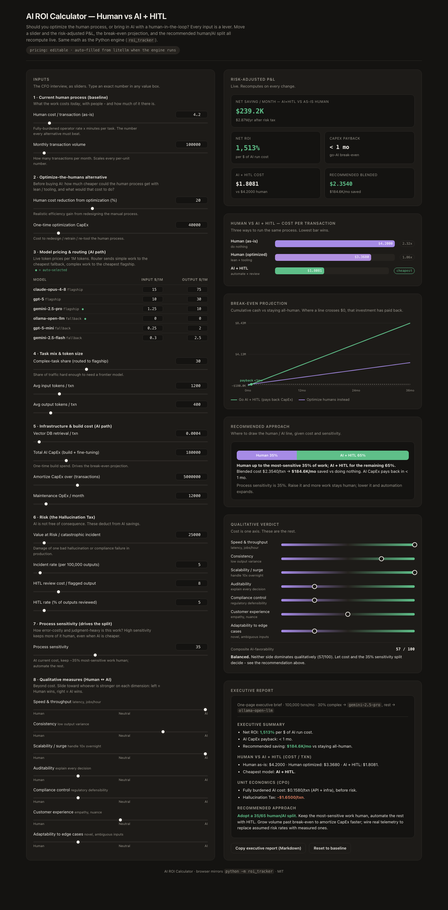

# Worked example - NorthPay support-ticket triage

A five-minute walkthrough of the whole calculator on one realistic scenario. No prior context needed.

## The situation

**NorthPay** (fictional fintech) handles **180,000 support tickets a month**. Today a person reads each ticket, tags it, and drafts a first reply - roughly 5 minutes at a fully-burdened $42/hour, so **$3.50 per ticket**.

Leadership is weighing three options:

1. **Do nothing** - keep the human process as-is.
2. **Optimize the humans** - macros, tooling, training. Estimate 25% faster, costs $50K one-time.
3. **AI + HITL** - an AI drafts the reply; a human reviews the risky 8%. Build cost $160K.

Which one, and if AI, how much of the work should it take?

## The same scenario in the dashboard



*Full-page render of `dashboard/index.html` (also as [PDF](assets/dashboard.pdf)). Every number below appears live on this page.*

## Run it

```bash
PYTHONPATH=src python3 examples/support_triage.py
```

Or open `dashboard/index.html` and dial in the same numbers on the sliders - the answers update live.

The inputs live in [`support_triage.py`](support_triage.py) as a plain `FinancialBaseline` - every field is commented.

## The answer

### 1. Human vs AI + HITL - cost per ticket

| Operating model | Cost / txn | Cost / month |
|---|--:|--:|
| Human (as-is) | $3.5000 | $630.0K |
| Human (optimized) | $2.6375 | $474.8K |
| **AI + HITL** | **$1.3774** | **$247.9K** |

Optimizing the humans is real money ($155K/month saved). But **AI + HITL is cheaper still** - even after loading in the API cost, retrieval, amortized build, *and* the risk tax.

### 2. What "AI + HITL cost" actually contains

The $1.3774 is not just the token bill. It is the **Fully Burdened Cost Per Output**:

- Fully burdened AI compute (CPO): **$0.0974/txn** (API + vector DB + amortized CapEx + OpEx)
- Hallucination Tax: **+$1.2800/txn** - the expected cost of a wrong compliance-sensitive reply ($20K damage x 1-in-25,000 rate) plus the human double-check on 8% of replies

The risk tax dominates - which is the point. Cheap tokens do not make a process safe; the tax keeps the number honest.

### 3. Break-even - does the $160K build pay back?

Cumulative net cash vs staying all-human:

| Month | Go AI + HITL | Optimize humans |
|--:|--:|--:|
| 0 | -$160,000 | -$50,000 |
| 2 | $604,136 | $265,000 |
| 4 | $1,368,272 | $580,000 |
| 12 | $4,424,818 | $1,840,000 |

The AI build **pays back in under half a month** (month 0.4), then pulls far ahead of the optimize-humans path. In the dashboard this is the chart with the payback dot on the $0 line.

### 4. Recommended approach - where to draw the line

Cheaper is not the whole story. Process sensitivity is set to **30%** - this work needs some human judgment and carries compliance risk. So the recommendation is **not** "automate everything":

> **Keep the most-sensitive 30% of tickets human; move the remaining 70% to AI + HITL.**
> Blended cost **$1.7554/txn** -> **$314K/month** saved vs doing nothing.

Slide sensitivity up and more work stays human; slide it down and AI expands. That single lever is how you tune the split to your risk appetite.

### 5. Qualitative verdict (dashboard)

Cost says AI. The qualitative panel adds the rest: AI wins on speed, consistency, and scalability; humans win on auditability, compliance defensibility, and edge-case judgment. With moderate sensitivity, the composite verdict lands on **"automate the bulk, keep humans on the sensitive slice"** - which is exactly the 30/70 split above.

## The takeaway

For NorthPay: **don't just optimize the humans - adopt a 30/70 human/AI split.** It saves ~$314K/month, pays back the build in under a month, and keeps people on the tickets where their judgment actually matters.

Change any number in `support_triage.py` (or the dashboard sliders) and the recommendation moves with it. Push the risk tax high enough, or the volume low enough, and the engine will tell you to stay human - that honesty is the feature.
